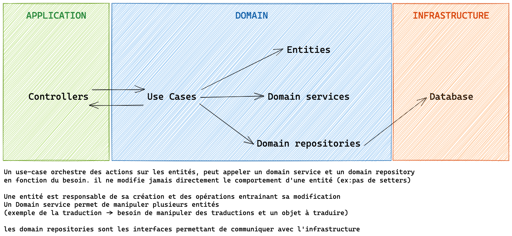

## How I contributed to this project
First, before starting to fix the issue, I began restructuring to separate the business logic from the technical code 'Spring framework' code in order to ensure separation of concerns and keep the domain isolated.
### Structure :



Each of these couche is composed with clean architecture package classification

Application : Where we put every endpoints our consumers need to know.

Domain : Contains our event business use case and business rules.

Infrastructure : Contains access to some of our dependencies such database or external rest API.
```
USE CASE : Define the business action performed: AddHeight
REPOSITORY : Define the technical action executed by the database: eventRepository.save(event)."
```


## Add comment issues
### Adding a comment is not working
- I opened the browser console and saw a 500 PUT error
- I added a logger in the PUT API Rest request, and the log appears correctly in the application logs
- I checked the JavaScript call to ensure it's correct PUT HTTP Request. 
- I added an integration test for the case of adding a comment and followed it with unit tests for the email modification. My tests passed successfully.
- I restarted my JAR, and now adding the comment works fine.


### Delete event
- I added loggers to trace the entire event deletion chain controller to repository database. 
- I analyzed the code and the delete operation in the JpaRepository interface, which is configured with a readOnly transaction.
- I added a transaction in the use case service (EventService) method to ensure a single transaction for the entire event deletion flow and removed the readOnly transaction in the repository.

## Note
- I created a ControllerAdvice class to present exceptions in a more user-friendly manner. Additionally, I introduced a custom exception class to handle exception cases.
- I add integration test. I add unit tests for all controllers, service and repository.
- Configure the classes to depend on interfaces rather than implementations to simplify the product's maintainability.
- Creation of an ApplicationError to make HTTP status errors easier to understand.
- To avoid memory overload and container crashes, we should avoid fetching everything in getFilter and instead execute an SQL query.
- Add spring validator to check requet PUT HTTP update nbStars between 0 and 5.

Bonus:
- Add a Spring validator to check HTTP request like PUT HTTP request updates nbStars between 0 and 5.


For the robustness of our API, it would be better to use a tool like Karate to test its functional behavior.
